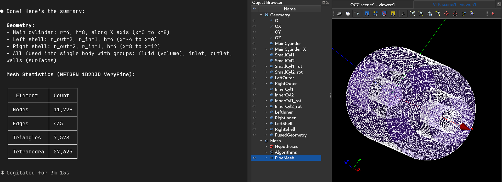
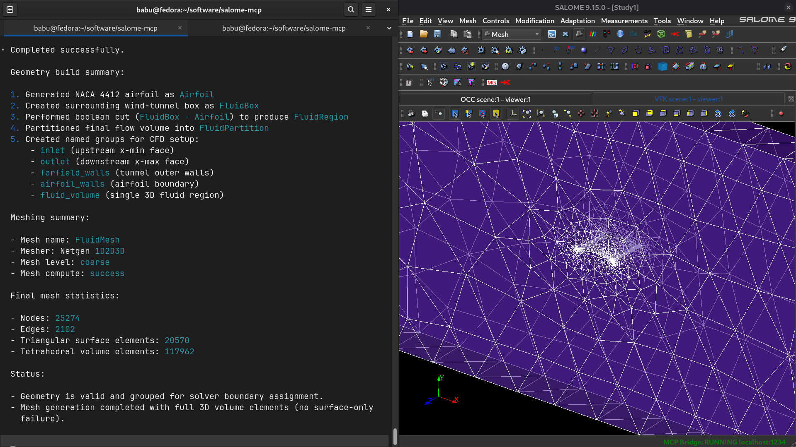

# SalomeMCP

SALOME Model Context Protocol for agentic use

## Overview
This repository provides three components:
1. SALOME GUI plugin to start/stop the local bridge port.
2. SALOME-side bridge (`salome_bridge.py`) that executes GEOM/SMESH operations.
3. MCP server (`salome-mcp`) that agent clients connect to.

<!-- Runtime model: -->
<!-- 1. Start SALOME GUI. -->
<!-- 2. Start bridge from `Tools -> Plugins -> MCP Bridge`. -->
<!-- 3. Start your MCP client (configured to run `salome-mcp`). -->
<!-- 4. Agent tool calls flow: `Agent -> MCP server -> SALOME bridge -> SALOME GUI session`. -->

## Requirements
1. SALOME 9.x
2. Python 3.10+
3. [uv](https://docs.astral.sh/uv/)

## Setup

### 1) Install Python dependencies
```bash
cd /path/to/salome-mcp
uv sync
```

### 2) Install SALOME plugin files
```bash
mkdir -p ~/.config/salome/Plugins   # or wherever your plugins folder is located
cp salome_plugin/*.py salome_bridge.py ~/.config/salome/Plugins/
```

## Configure MCP Client
It is recommended that you set up the mcp server inside a particular project, instead of globally.

### Claude Code CLI (from inside your project root)
```bash
claude mcp add --scope project salome -- uv run --directory /path/to/salome-mcp salome-mcp
```

### Codex CLI 
```bash
codex mcp add salome -- uv run --directory /path/to/salome-mcp salome-mcp
```

### Custom Host and Port
By default, the bridge uses `localhost:1234`. You can set your custom host/port in the SALOME GUI bridge settings, then simply prompt your agent to connect to that.

## Usage
1. Start SALOME
2. In GUI: `Tools -> PLugins -> MCP Bridge -> Start (default)`
3. Open your agent and prompt to ping salome. The agent should use `check_salome_status` and return success
4. The agent should now be able to make tool calls based on your prompts. Check [samples](#samples)
5. End session with `MCP Bridge -> Stop`

## Tool Coverage
These are the tool calls that can be used by your agent. You probably don't need to know this
### General
- `ping_salome`, `check_salome_status`, `get_study_info`, `get_scene_summary`, `list_study_objects`: Session and study status/overview

### Geometry (GEOM)
- `create_box`, `create_cylinder`, `create_sphere`, `create_naca4_airfoil`: Primitive creation
- `translate_object`, `rotate_object`, `copy_object`, `duplicate_object`, `rename_object`, `delete_object`: Transforms and object lifecycle
- `boolean_operation`, `fuse_objects`, `cut_objects`, `common_objects`: Boolean operations (`fuse`, `cut`, `common`)
- `create_group`, `create_groups`, `create_surface_group`, `create_volume_group`: Group creation
- `make_partition`, `explode_shape`, `import_geometry`, `export_geometry`, `get_object_info`, `list_subshapes`: Partition, explode, I/O, and inspection

### Mesh (SMESH)
- `import_mesh`, `export_mesh`: Mesh I/O
- `create_mesh`: Standard mesh setup with hypotheses
- `create_mesh_with_hypotheses`: Explicit algorithm + detailed hypotheses meshing
- `compute_mesh`, `get_mesh_info`: Mesh compute and statistics

### Advanced
- `execute_salome_code` (raw Python code)

> [!WARNING]
> `execute_salome_code` executes arbitrary Python inside SALOME. Keep bridge access local and trusted.

## Samples

### Prompt 1

> lets do these step by step: 1. make a cylinder r = 4 h =8 and place it along x axis 2. make two more cylinders of r = 2 and h = 4 3. place these cylinders on either of the circular ends 4. carve a cylinder out of these smaller ones to make two shells of rout = 2 and rin = 1 5. fuse all 6. create the single vol group 7. make surface groups inlet outlet and walls 8. make a mesh with netgen 1d 2d 3d very fine mesh. 9. compute mesh and report its stats



### Prompt 2
> 1.make a naca 4412 airfoil 2. create a fluid box region around it for wind tunnel testing 3. cut the region for the air 4. make a partition and name all surface and vol groups 5. generate a netgen 1d2d3d coarse mesh 6. report mesh stats


